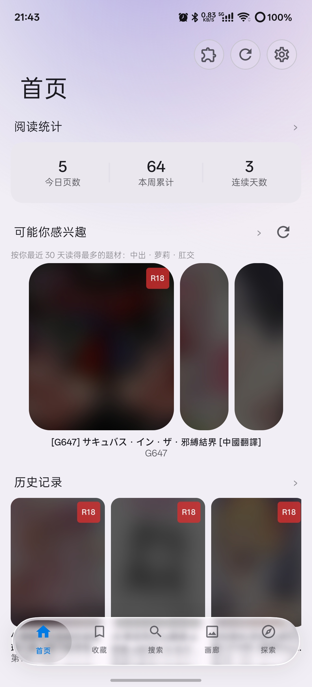
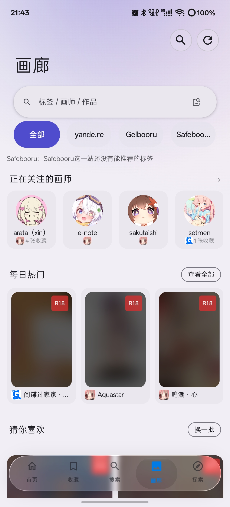
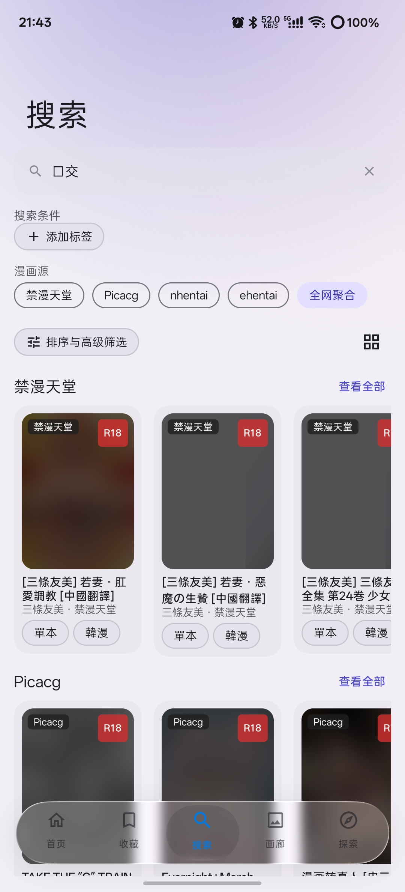
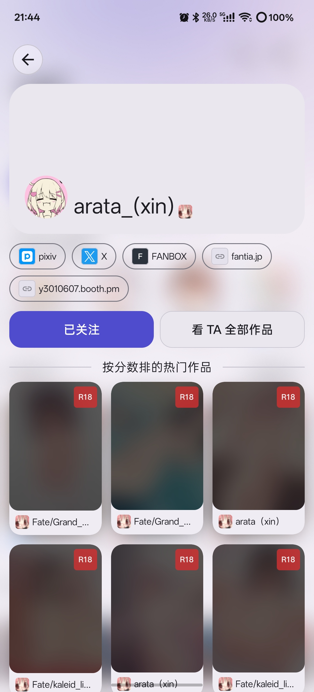
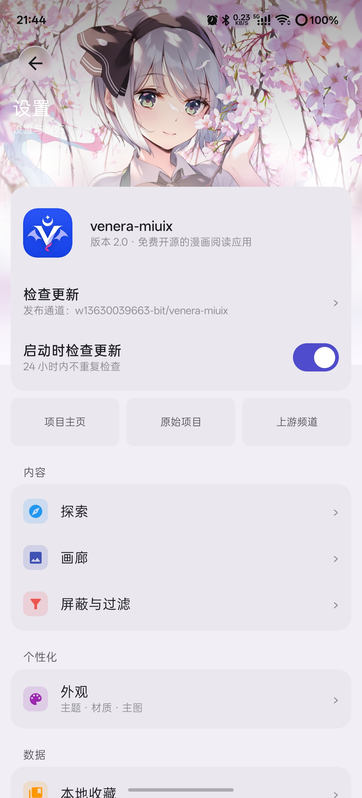

<div align="center">


# venera-miuix

**An Android manga/comic reader: comic sources are described in JavaScript, and local and online libraries are read in one place.**
This branch rewrites the whole Venera app from Flutter into pure native Kotlin + Jetpack Compose, and adds a gallery image-board module that upstream does not have.

[](https://github.com/w13630039663-bit/venera-miuix/releases)
[](https://github.com/w13630039663-bit/venera-miuix/tree/compose-migration)


[](LICENSE)

[简体中文](README.md) | **English**

</div>

---

## Table of contents

- [What is this](#what-is-this)
- [Screenshots](#screenshots)
- [Highlights](#highlights)
- [Features](#features)
- [Differences from upstream](#differences-from-upstream)
- [Known gaps and deliberate non-goals](#known-gaps-and-deliberate-non-goals)
- [Download and installation](#download-and-installation)
- [Building from source](#building-from-source)
- [Architecture and tech stack](#architecture-and-tech-stack)
- [Project layout](#project-layout)
- [Writing a comic source](#writing-a-comic-source)
- [Contributing](#contributing)
- [Acknowledgements](#acknowledgements)
- [License](#license)

---

## What is this

**Venera** is an excellent third-party comic reader: comic sources are written as JavaScript plugins, and it aggregates local and online comics with favorites, downloads, comments and tags. Its original author has publicly stated that maintenance has stopped due to limited capacity, and welcomes forks.

This branch (`compose-migration`) does three things, plus one new module:

1. **New stack** — a full rewrite in Kotlin + Jetpack Compose; no Flutter / Dart / Rust runtime is carried over. The artifact is a single Android app.
2. **New interface language** — every screen is rebuilt around Xiaomi HyperOS's Miuix design system, with the official liquid-glass library integrated; Material 3 is kept as a switchable second style.
3. **Protocol unchanged** — the ComicSource JavaScript plugin protocol stays byte-for-byte compatible with upstream, so the [venera-configs](https://github.com/venera-app/venera-configs) repository can be installed and fully updated in one tap; 34 source scripts (33 unique sources) ship in the APK as an offline fallback.
4. **One new module** — the fourth slot of the bottom bar, **Gallery**, turns yande.re / Gelbooru / Safebooru into a module fully isolated from the comic side.

> **Install identity**: this branch keeps the exact same application ID as `master` (the Flutter version of venera-miuix) and shares its release channel, so downloading from Releases gives you the same app. Flutter-era data is **not migrated automatically**; to move devices or come over from the Flutter build, use Settings → import data to read an official Venera or PicaComic archive and merge in your favorites and reading history.

- Original upstream Venera (Flutter): <https://github.com/venera-app/venera>
- This repository's `master` branch (Flutter venera-miuix): <https://github.com/w13630039663-bit/venera-miuix>

## Screenshots

<p align="center">
  
  
  
  
  
</p>

<p align="center"><sub>Home · Gallery · Search · Artist page · Settings — covers in these screenshots are masked by the rating filter and contain no recognizable original artwork</sub></p>

## Highlights

**Native rewrite, no runtime layer left behind.** Flutter, Dart and Rust are gone from the dependency tree; startup no longer waits on an engine or an isolate. R8 obfuscation plus resource shrinking, packaged per ABI.

**Correctness logic lives in plain JVM functions.** Rating decisions, image unscrambling block math, chapter completeness, archive encoding, tag splitting, registrable-domain cookie chains — the logic that actually decides correctness does not depend on the Android framework, so changing one rule fails a test immediately instead of waiting to be found on a device.

**The official source repository just works.** A system WebView hosts the source scripts and a shim layer reproduces the original API surface; the upstream `index.json` supports update-all / update-one / custom repository URLs / local import for debugging / visual editing. MangaDex, Copy Manga and Baozi also ship as native Kotlin sources, as a fallback path when the JS engine misbehaves.

**Gallery is genuinely isolated.** It owns its three layers, its own tag dictionary and its own two Activities, and most importantly its **own image-loading instance and cache budget** — the comic side's default configuration is untouched, while the gallery uses a separate directory and a separate budget (64 MB in memory, 512 MB on disk by default and adjustable). Only the pure technical layer is shared: connection pool, cookies, rate-limit intervals and anti-hotlink User-Agents.

**Rating and blocking is a decision chain, not a switch.** Three masking states + a built-in rating preset table for 33 sources + four rule categories with optional regex, evaluated in the order **user rules → source presets → explicit keyword fallback**. Masking blurs the cover only; titles and tags stay visible.

**Backup formats are interoperable with upstream.** Our own `.venera` archive exports and imports in one tap, and the app also reads official Venera's SQLite archive and PicaComic's `.picadata`, merging favorites and history entry by entry — source resolution relies on a reimplementation of Dart's VM hash function, so you never have to re-export into our format first.

**Visual sizing is calibrated against real device pixels.** Collapsing large top-bar titles with frosted circular icon buttons, segmented controls where every pill carries its own outline, a liquid-glass bottom bar, system-level predictive back across Activities, and a shared-element transition from cover to detail. Every dimension comes from an upstream value or an existing token in the app.

## Features

> Every line below has a real call site in the code. Anything implemented but not wired to an entry point is moved to [Known gaps](#known-gaps-and-deliberate-non-goals) and never appears here.

### Reader

- **5 layouts**: vertical strip, horizontal continuous scroll-through, left-to-right paging, right-to-left paging, and two-page spread — switchable both in Settings and in the reader panel.
- **Look-ahead preloading**, adjustable 0–20 pages, so paging never waits on the network.
- **Auto cruise**: constant-speed strip scrolling (15–480 px/s) and a timed auto-turn interval for paged modes; touching pauses it. *The scroll-through and two-page layouts do not offer cruise.*
- **Volume-key paging** (including continuing into the next chapter) and **edge-tap paging** (outer 25% of the screen, direction invertible, mirrored in right-to-left mode).
- **Two-finger zoom**: large images are subsampled by the library. *Zoom only applies in the two paged modes.*
- Chapter drawer, save a page to the gallery, share a page, night soft-light filter, keep-screen-on, page spacing.
- Page addresses are resolved per page by the source script — sources that need signed or expiring URLs can still render correctly.
- Wide screens get top-bar and drawer width caps; no separate wide-screen pagination layout.

### Comic source engine

- Compatible with the official ComicSource JavaScript protocol, hosted in a system WebView.
- **34 source scripts (33 unique sources)** ship in the APK as an offline fallback; one-tap install / update all / update one, with custom repository URL, local import for debugging, visual edit and delete, source pinning and ordering.
- Three native Kotlin sources built in: **MangaDex / Copy Manga / Baozi**.
- **Login**: account+password, embedded WebView web login, and raw cookie entry, with status checks, re-login and sign-out.
- **Aggregated search**: single-source search plus "search everywhere" running sources in parallel, grouped by source; structured tag search degrades automatically to client-side filtering on sources that do not support that syntax.
- **Source speed test and health**: parallel ping, home status row in four states (connected / degraded / failing / unknown) and re-measurable on tap, source list carries latency colour coding.

### Gallery (a module isolated from the comic side)

- **Three boards aggregated**: yande.re + Gelbooru + Safebooru, fetched concurrently → deduplicated → shuffled into one masonry screen; **each failing lane reports its own reason** instead of silently returning a partial page as if it were complete.
- **Daily hot** as a home preview row plus a full-screen secondary page (view all / shuffle again); **For you** builds its wall from tags in your gallery favorites, seeded so results are reproducible and shuffleable.
- **Followed artists**: follow list, circular avatar row (with favorite counts and site icons), artist page in its own Activity, cross-site work aggregation, and **artist alias resolution** (when a board returns zero posts, re-search once using that board's own alias identifier; a non-zero result is never substituted). *Alias resolution is currently wired for yande.re only.*
- **Reverse image search** via SauceNAO. *Requires your own free API key in Settings.*
- Viewer toolbar: favorite, original-file toggle, save to gallery, info sheet, share, slideshow (1–15 s adjustable).
- **Video posts** play inline with a badge on the card. *Only Safebooru reports duration.*
- Chinese tag glossary comes from the gallery's own dictionary (derived from ffdkj's Danbooru Simplified/Traditional/English table); the comic side uses the EhTagTranslation database instead — the two are never mixed.
- **6 ranking tabs** in the search area (default/newest / day / week / month / year / all), plus a date sheet to pick a specific period. *Gelbooru's API cannot express a time window, so that board lists only "default" and "all" rather than offering four tabs that would silently return all-time results.*
- Animated images animate **only inside the viewer**; cards always show the static first frame, and GIF loading is Wi-Fi-only by default.

### Favorites and history

- **Local favorites**: multiple folders, batch delete / move / copy, and a shared-element transition from cover to detail.
- **Network favorites**: every source expands in place as an accordion in one list, switch sources with horizontal source pills, pull-to-refresh tracks your finger.
- **Image favorites**: single pages and illustrations favourited while reading get their own wall; gallery favorites are a fourth independent store. All four favorite panels share one long-press multi-select implementation.
- **History**: cards show how far you read last time; reachable from the home history section, a settings row, and the reader top bar.

### Downloads and local library

- Multi-threaded downloading with **1–16** concurrency (applies to newly queued tasks); chapter-level multi-select, pause / resume / delete per task, progress notifications.
- **Three-state chapter completeness**: partial chapters get an "incomplete offline" badge instead of pretending to be complete.
- **CBZ export** (zip a chapter directory and hand it to the system share sheet) and **CBZ import** (unpack into a bookshelf directory, namespaced by original filename).
- Download root is user-selected (external storage and secondary volumes supported), and existing tasks migrate when it changes.
- The local bookshelf scans the current root automatically (source / comic / chapter levels + metadata file).

### Reading statistics

- Home summary card: pages today, cumulative this week, streak days.
- Stats page: total reading time, cumulative pages, top 10 most read, 14-day bar chart, streak check-ins.
- **Tag distribution** (last 30 days / last year) and **reading trajectory** (top tag per month); any tag drills straight into aggregated search.
- Simplified, Traditional and English tags are merged through a built-in table of 3,980 Simplified/Traditional pairs, so one subject gathers all its spellings.

### Rating and blocking

- **Three masking states**: no filter / blur covers / hide completely, defaulting to no filter. The chain runs in code order: **user rules → built-in presets for 33 sources → explicit keyword regex fallback**. *A blurred cover does not become clear on tap, and "hide completely" currently takes effect fully only on some list pages — both caveats are stated in the app's own copy.*
- **Blocking AI-generated content**: only explicit markers count (`ai` / `ai-generated` / `ai生成` / `ai绘图` tags, or `[AI Generated]`, `[AI Art]`, `【AI】` in a title); a bare `ai` substring does not, and there is no heuristic detection.
- **Four rule types**: keyword / tag / artist / post ID, each with a regex mode, counts visible on the settings page. Matching differs between the two sides, deliberately: **the comic side matches substrings** (tags there are free text and Chinese has no separators, so whole-word matching would un-block what the user already blocked); **the gallery side matches whole words** (`ai` hits `ai` / `ai_generated`, and no longer hits `long_hair`).
- **Anti-peek**: system-level `FLAG_SECURE` blocks screenshots and screen recording, blanks the recent-tasks thumbnail, covers every Activity, is switchable, and survives restarts.

### Backup and sync

- Local `.venera` archive, format version **5**, nine members: metadata, reading history, comic favorites, folder list (with network-folder bindings), reading statistics, blocking rules, illustration-favorite metadata and addresses, gallery follow list, gallery favorites. The whole package is parsed into memory before anything is written, so a format error fails before any write; older archives are still recognised and restored in full, just without the newer members.
- Every number on the stats page and the home summary is computed from the statistics table, so shipping that table ships the whole page.
- **WebDAV**: manual upload / list / restore, keeping the **10** most recent archives by timestamp after each upload.
- **Importing foreign archives**: reads official Venera (`.venera` SQLite) and PicaComic (`.picadata`) directly, merging favorites and history entry by entry. The two gallery members structurally cannot come from a foreign archive — the gallery module is specific to this branch and has no upstream counterpart.

### Appearance

- **Two interface styles, Miuix / Material 3**, light / dark / follow system. *What switches is the token set — colour, shape, type scale; two component suites still coexist inside one screen (a structural gap, not a missed wiring).*
- **Custom theme colour**: seed colour #RRGGBB + 25 preset palettes + wallpaper-based dynamic colour (API 31+).
- **Surface material**: solid / liquid glass; **bottom bar**: liquid glass / MD3 elevated / solid.
- **Tag translation display**: follow system / always Simplified / always Traditional / original.
- Custom header image and quote card on the settings home page; 17 settings sub-pages.

### Network and performance

- **HTTP and SOCKS5 proxies**, download concurrency, per-host circuit breaking (2 failures / 60 s) with a one-tap reset.
- **Cloudflare challenge solving**: triggered on 403/503 → a challenge page is opened once per host on a debounce → success requires the clearance cookie, with UA and cookie persisted as a pair.
- **Cloudflare preferred-IP routing**: custom DNS against your own IP table, **off by default, ships with no IPs, applies only to declared hosts**.
- Rate-limit interceptor, per-host User-Agent and cookie policy (registrable-domain chain resolution).
- Covers and pages are **decoded at display size** (sample factor is a power of two, capped at 8).
- **Deep links**: post URLs from 29 hosts open directly in the app (Copy Manga, Baozi, MangaDex, Bilibili Comics, jmcomic / 18comic, E-Hentai / ExHentai, nhentai, Wnacg, hitomi.la, comick and others); shared plain text can invoke a search.
- **In-app update check**: reads the newest tag from this repository's Releases, throttled to once per 24 hours, off by default, and opens a browser download rather than fetching an APK itself.

## Differences from upstream

### Versus official Venera (Flutter)

| Capability | Official Venera | This branch |
| --- | :---: | :---: |
| Stack | Flutter / Dart + Rust | **Pure native Kotlin + Jetpack Compose** |
| Platforms | Android · iOS · Windows · Linux · macOS | **Android 13+ only** |
| Interface language | Material 3 | **Miuix (HyperOS style)** + switchable Material 3 |
| Bottom bar | Standard NavigationBar | **Floating liquid-glass pill bar** (glass / MD3 elevated / solid) |
| Main tabs | 4 + search/settings as actions | **5**: Home · Favorites · Search · **Gallery** · Explore |
| Gallery image boards | ❌ none | ✅ yande.re / Gelbooru / Safebooru as an isolated module |
| Artist follows and artist page | ❌ none | ✅ follow list + avatar row + cross-site aliasing + own Activity |
| Recommendations from favorites | ❌ none | ✅ daily hot secondary page + For-you wall (seeded, shuffleable) |
| Reverse image search | ❌ none | ✅ SauceNAO (bring your own free API key) |
| Reading stats / tag corpus | ❌ none | ✅ summary card + stats page + tag distribution + trajectory + drill-down |
| Rating mask | ❌ none | ✅ three states + built-in presets for 33 sources |
| Block list | keywords only | ✅ keyword / tag / artist / post ID, regex supported |
| Anti-peek | ❌ none | ✅ screenshot and recording blocked, recent-tasks blank, switchable |
| Theme colour | dynamic + 6 presets | ✅ seed colour + 25 presets + wallpaper |
| Transitions | standard | ✅ shared element + predictive-back tracking + gallery fly-in |
| Archive interoperability | — | ✅ imports official `.venera` and PicaComic `.picadata` |
| Unit tests | 1 Dart test file | ✅ 92 pure JVM test files / 749 cases |
| Local formats | ZIP / 7Z / CBZ / EPUB / folder | ✅ folder + CBZ import/export (**no archive reading**, see gaps) |
| Headless / CLI mode | ✅ | ❌ not planned |

### Versus this repository's `master` branch (Flutter venera-miuix)

`master` is this branch from the Flutter era (fork point `2026-09-16`, where the Miuix styling, blocking system and reading statistics already landed). `compose-migration` split off from it, rebuilt all of it on the native stack, and kept going:

| Capability | master (Flutter) | compose-migration |
| --- | :---: | :---: |
| Stack | Flutter / Dart + Rust | **Kotlin + Compose** |
| UI backend | Miuix (Flutter port) | **Miuix KMP** + Material 3 dual backend |
| Source JS execution | flutter_inappwebview | **system WebView + JS bridge** + shim reimplementation |
| Gallery boards / artist follows / daily hot / reverse search | — | ✅ |
| Cloudflare preferred IP | — | ✅ (off by default) |
| JVM correctness tests | 1 Dart test file | ✅ 92 files / 749 cases |
| Radial transition (preview card ⇄ reader) | ✅ | ❌ not carried over in the migration |

### Upstream has it, this branch does not

- **Desktop and other mobile platforms**: upstream ships Windows / Linux / macOS / iOS through Flutter. This is an Android-only project; cross-platform needs a separate shell — feasibility is assessed and archived in `docs/rounds/windows-port-feasibility-2026-10.md`, **not started**.
- **Reading EPUB / 7Z / ZIP archives directly**: upstream's reader opens archive files; here local comics are always served to the reader as directories, and CBZ import unpacks into a directory.
- **Biometric privacy lock**: upstream has launch authentication and re-lock on background; this repository contains no such capability. The rating mask is content filtering, not a privacy lock.
- **Archive download protocol**: upstream has a dedicated download path for sources declaring archive capability (E-Hentai, for example); here downloads are page by page only.
- **Headless mode**: upstream documents running source scripts without a UI; there is no counterpart here.

## Known gaps and deliberate non-goals

This section exists on purpose. Anything implemented but not reachable from an entry point, or explicitly judged as not-to-be-done, is stated here rather than mixed into the feature list.

**Implemented, but not wired to an entry point (currently unusable)**

- **Chapter comments**: the sheet component and the source protocol both exist, but nothing in the reader switches the panel to comments — it cannot be opened.
- **Follow-up update checks**: the periodic worker and the page are written, yet the only place that can turn the switch on has no call site — users cannot enable it.
- **Log viewer**: the page is reachable, but nothing writes to the log store, so it opens with a single startup line.
- **Per-source rating corrections**: the built-in preset table for 33 sources is in effect; what is missing is per-source user override and its picker — a source judged wrongly today cannot be fixed in the UI.
- **Streaming aggregated search API**: defined but never called; the parallel search branch is what actually runs.
- **Hand-rolled zoom gestures**: the gesture engine has no call site; the zoom library's own implementation is what is live.

**Structurally out of scope**

| Item | Note |
| --- | --- |
| Windows / Linux / macOS / iOS | Android only. Port feasibility assessed and archived; not started. |
| EPUB / 7Z / ZIP direct reading | Local comics are always served as directories; CBZ import unpacks. |
| Biometric privacy lock | No launch authentication, no re-lock on background. The rating mask is content filtering, not a lock. |
| Archive download protocol | Page-by-page downloads only. |
| Headless CLI mode | No counterpart. |
| Reader-only wide-screen layout | Only top-bar/drawer width caps; no landscape two-column reader. |
| DoH, pinch-to-zoom, "not implemented" grey rows | Explicitly withdrawn, so they never occupy a switch slot. |

**Capabilities with conditions**

- **Gelbooru requires your own API credentials** — anonymously it returns no images at all; yande.re and Safebooru work anonymously.
- **Reverse image search** needs your own free SauceNAO API key; anonymous requests do not get past Cloudflare.
- **Cloudflare preferred IPs** are off by default and ship with no addresses — you fill the table yourself.
- **Animated images** animate only in the viewer, and load on Wi-Fi by default.
- **Auto cruise** is unavailable in the scroll-through and two-page layouts; **two-finger zoom** only applies in the two paged modes.
- **WebDAV** is manual upload / restore, with no sync scheduler; "keep 10" is client-side cleanup after upload.
- **The archive contains no image files**: illustration favorites carry only metadata and an address, and are reloaded from that address after restore — offline you get broken images, and some sources hand out signed URLs that expire after days. Including images would inflate the archive linearly with the number of saved pages.
- **Also not in the archive**: the artist avatar address table, the gallery feed cache and the tag dictionary (all three are regenerable), installed comic source scripts, preferences, cookie sessions, and the download queue.
- **App Links do not set `autoVerify`**, and there are no intent filters for `.venera` / `.cbz` file types — backups and archives always go through the system file picker.

## Download and installation

Built packages are published on the **[Releases](https://github.com/w13630039663-bit/venera-miuix/releases)** page; Settings → app → check for updates points at the same channel (off by default). Artifacts are split per ABI:

- `arm64-v8a` — the right choice for almost every modern phone;
- `armeabi-v7a` — older 32-bit devices;
- `x86_64` — emulators;
- universal — largest, use it when in doubt.

> **Requirements**: Android 13 (API 33) or newer; target API 37, no `maxSdk`.
> **Permissions**: `INTERNET`, `ACCESS_NETWORK_STATE`, `VIBRATE`, `POST_NOTIFICATIONS`, and `MANAGE_EXTERNAL_STORAGE` (needed only when the download root is set to a shared external directory; the app-private directory avoids it). Background work is WorkManager periodic jobs only — there is no resident service.

## Building from source

### Prerequisites

1. **JDK 17**;
2. **Android SDK** (`sdk.dir` in `local.properties`; Android Studio generates it when you open the project).

No Flutter, no Dart, no Rust.

### Commands

```bash
# debug APK → app/build/outputs/apk/debug/app-debug.apk
./gradlew :app:assembleDebug

# release: R8 obfuscation + resource shrinking, split per ABI (armeabi-v7a / arm64-v8a / x86_64 / universal)
./gradlew :app:assembleRelease

# pure JVM correctness tests (92 files / 749 cases, no device needed)
./gradlew :app:testDebugUnitTest

# a single test class
./gradlew :app:testDebugUnitTest --tests "*ChapterCompletenessTest*"
```

> **Signing**: release signing material is read from `key.properties` at the repository root (`storeFile` / `storePassword` / `keyAlias` / `keyPassword`). That file, together with `*.jks` and `*.keystore`, is gitignored — **neither keys nor passphrases ever enter version control**, and the keystore itself lives outside the repository. Without that file the release build falls back to the debug keystore and says so in the build log; such an artifact is sideloadable but **must not be distributed** (its signature differs from the release line, so an in-place upgrade will fail).
> **R8 mode**: full mode is explicitly disabled — it removes synthetic methods referenced only reflectively, too risky for material3 alpha and the WebView JS bridge.
> **material3 is pinned**: `1.5.0-alpha22` must match what Miuix resolves at runtime; run `:app:dependencies --configuration debugRuntimeClasspath` before changing it, or you will hit a `NoSuchMethodError` crash.

## Architecture and tech stack

### Layers

```text
UI layer (Compose)
  feature/ Home · Search · Favorites · Network favorites · History · Detail · Explore · Settings (17 sub-pages) · Sources · Downloads · Logs
  reader/  Reader (5 layouts + cruise + zoom + chapter drawer)
  gallery/ Gallery (data / domain / ui, own ImageLoader + own Activities)
  components/ + ui/tokens/  Shared components and design tokens (Miuix / MD3 dual backend)
        │
Business and correctness layer (pure Kotlin, JVM-testable)
  source/  ComicSource abstraction + 3 native sources + JS source implementation
  engine/  WebView JS engine and the bridge (shim + init scripts)
  security/guard/  Content guard decision chain and blocking rules
  stats/   Reading statistics and tag corpus
  sync/    Archive encoding, WebDAV, foreign archive import (incl. the Dart hash reimplementation)
  download/ Scheduling, chapter completeness, CBZ, local bookshelf
        │
Data and network layer
  data/db/        Hand-written SQLite (no Room): core db (history / stats / image favorites / sources / guard rules)
                                    favorites db (folder list + one table per folder)
                  The gallery side does not use SQLite — follow list, favorites, avatars and the feed cache are JSON files
                  (all write a temp file then rename; an unparseable file is kept as .corrupt-<timestamp> before starting empty)
  data/prefs/     Single source of preferences
  data/network/   OkHttp stack: per-host UA and cookies, circuit breaker, rate limiting, Cloudflare solving and preferred-IP DNS
```

**Isolation discipline**: `gallery/` shares only the pure technical layer with the comic side (the OkHttp client and the image-streaming marker) — never the image-loading instance or the cache budget, and the comic side's configuration stays exactly as shipped. When a gallery image hits a wall, the error is rethrown and reported in one sentence instead of opening the comic side's interactive challenge.

### Tech stack and versions

| Area | Choice | Version | Why |
| --- | --- | --- | --- |
| Language | Kotlin | 2.4.10 | The Compose compiler tracks the Kotlin version |
| Build | Android Gradle Plugin | 9.3.2 | Compile-time API 37 |
| UI | Jetpack Compose | 1.7.8 | Declarative + custom transitions |
| Design system | Miuix KMP | 0.9.4-rc01 | HyperOS look; Material 3 backend retained |
| Material | androidx.compose.material3 | **1.5.0-alpha22** | Pinned by Miuix at runtime, not chosen |
| Liquid glass | Kyant0/AndroidLiquidGlass | 2.0.1 / 1.2.1 | Bottom-bar blur + refraction + vibrancy |
| Motion spec | material-motion-compose-core | 2.0.1 | Shared-axis parameters taken from the spec, not inflated locally |
| Colour extraction | MaterialKolor | 5.0.1 | System dynamic colour only accepts wallpapers, not a seed colour |
| Navigation | navigation-compose | 2.10.1 | Type-safe routes + predictive-back arguments |
| Images | Coil 3 (compose + okhttp + gif) | 3.6.2 | Per-host anti-hotlink headers; GIFs need an explicit decoder |
| Zoom | Telephoto | 0.19.0 | Large-image subsampling delegated to the library |
| Video | media3 (exoplayer + ui only) | 1.11.1 | No session/cast/downloader, keeps the APK smaller |
| Networking | OkHttp (+ logging) | 4.12.0 | Interceptor and custom DNS hook points |
| Parsing | Jsoup / Gson / kotlinx-serialization | 1.18.1 / 2.11.0 / 1.11.0 | HTML parsing and JS-bridge JSON |
| Background | WorkManager | 2.9.1 | Periodic jobs, no resident service |
| Database | Hand-written SQLite | — | No Room: we keep control of schema and migrations |
| Testing | JUnit 4 (pure JVM) | 4.13.2 | Correctness layer stays device-independent |

## Project layout

```text
venera-compose/
├── app/                                # The only Gradle module
│   └── src/main/java/com/venera/compose/
│       ├── MainActivity.kt             # Entry, main-tab host, window policies (anti-peek / back)
│       ├── VeneraApp.kt                # Parallel startup initialisation and periodic job scheduling
│       ├── feature/                    # Screens (incl. settings/ with 17 sub-pages)
│       ├── reader/                     # Reader
│       ├── gallery/                    # Gallery module (data / domain / ui)
│       ├── source/                     # ComicSource abstraction + native sources + JS source
│       ├── engine/                     # WebView JS engine and shim
│       ├── data/                       # db (hand-written SQLite) / prefs / network
│       ├── download/                   # Downloads, CBZ, local bookshelf
│       ├── sync/                       # Archives, WebDAV, foreign archive import
│       ├── security/guard/             # Content guard and blocking rules
│       ├── stats/                      # Reading statistics
│       └── components/ ui/             # Shared components and design tokens
│   ├── src/main/assets/
│   │   ├── sources/                    # 34 bundled source scripts + index.json
│   │   ├── two JS protocol compatibility scripts
│   │   ├── comic-side tag dictionaries (Simplified / Traditional) + 3,980 Simplified/Traditional pairs
│   │   ├── rating presets for 33 sources · gallery tag dictionary SQLite
│   │   └── licenses/                   # Licences of third-party dictionaries and components
│   └── src/test/java/                  # 92 pure JVM correctness test files
├── gradle/libs.versions.toml           # Single source of dependency versions (with reasons for pins)
├── screenshots/                        # Images used by this README
├── docs/                               # Workflow manual and per-topic designs
│   └── rounds/                         # Per-round plans, audits and measurement archives
├── memory/                             # Project knowledge base: decision records and measured limits
└── FREEZE-STATEMENT.md                 # Page freeze statement and exemptions
```

## Writing a comic source

The plugin protocol is identical to upstream Venera's; the specification lives in [`doc/comic_source.md`](https://github.com/w13630039663-bit/venera-miuix/blob/master/doc/comic_source.md), and plugin templates plus the JS API come from [venera-configs](https://github.com/venera-app/venera-configs) — the 34 bundled scripts come from that repository. Your own source can be imported locally for debugging on the sources page.

Implementation differences worth knowing:

- Source scripts run inside a **system WebView**, not a standalone JS engine — you only get the API surface the shim exposes;
- Page addresses are resolved per page, and there is a separate preview-address path (wired up, but not used to replace list thumbnails, since sources generally do not publish a low-resolution variant);
- Sources declaring a `search.optionList` get their sort / language / category options rendered as the search page's filter sheet;
- Rating decisions look at exactly three things: user blocking rules, the built-in presets for 33 sources, explicit keyword regex — fields declared by the plugin itself do not participate, so a source absent from the table only gets the keyword fallback (**the manual per-source override is not wired yet**, see the gaps section).

## Contributing

### Branch model

| Branch | Role |
| --- | --- |
| `compose-migration` | **Current development line**; releases are cut from it |
| `master` | Historical Flutter line of this branch (fork point `2026-09-16`), kept for reference and as the home of `doc/` |
| `upstream/*` | Read-only remote-tracking references to the official venera-app/venera |

### Engineering rules

Please align with these before opening a PR:

1. **No implementation notes in UI copy** — asterisks, backticks, internal jargon and "not implemented" grey rows never reach the interface; features deliberately not built are withdrawn entirely, so they never occupy a switch slot.
2. **No fake switches** — every preference must have a real consumer in the code; implementations without an entry point go into "known gaps", not into the feature list.
3. **Degraded paths fail loudly, never silently wrong** — if an adaptive branch fails it throws and explains; a partial result is never handed back as if complete.
4. **Take dimensions from existing sources** — upstream values or tokens already in the app; no invented numbers. Visual issues get measured in pixels before code changes.
5. **Push correctness into pure functions** — new correctness logic is extracted into Android-framework-free functions with JVM tests.
6. **Page freezes** — accepted pages (see `FREEZE-STATEMENT.md`) only accept real bug fixes and explicit regressions; drive-by visual refactoring is forbidden, and changes require review plus a recorded exemption.

### How to contribute

Fork this repository → branch off `compose-migration` → open a PR, and state how the change was verified (device / emulator / unit tests). Keep the `LICENSE` file and this document's copyright and licence notice.

This repository is an **unofficial** community branch with no affiliation to the original maintainers; please do not file issues against [venera-app/venera](https://github.com/venera-app/venera) about changes made here.

## Acknowledgements

- **[Venera](https://github.com/venera-app/venera)** — the upstream and original work; original author [@wgh136](https://github.com/wgh136) and all contributors. **All original copyright belongs to them.**
- **[venera-configs](https://github.com/venera-app/venera-configs)** — the comic source plugin repository and plugin API, origin of the 34 bundled scripts.
- **[Miuix](https://github.com/compose-miuix-ui/miuix)** — the design language and KMP component library (Apache-2.0).
- **[Kyant0/AndroidLiquidGlass](https://github.com/Kyant0/AndroidLiquidGlass)** — liquid glass material and animation.
- **[material-motion-compose](https://github.com/fornewid/material-motion-compose)** — the transition specification implementation.
- **[Telephoto](https://github.com/saket/telephoto)** / **[Coil](https://coil-kt.github.io/coil/)** — zoom gestures and image loading.
- **[EhTagTranslation](https://github.com/EhTagTranslation/Database)** — source of the comic-side tag translations.
- **ffdkj's Danbooru Simplified/Traditional/English tag table** — source of the gallery tag dictionary.
- Traditional Chinese tag translations provided by [@NeKoOuO](https://github.com/NeKoOuO).

## License

[GNU General Public License v3.0](LICENSE) (GPL-3.0). This repository keeps the upstream `LICENSE` file and all copyright notices unchanged.

```text
venera-miuix
Copyright (C) 2026 venera-miuix contributors

Based on Venera, Copyright (C) venera-app/venera contributors.
Licensed under the GNU General Public License v3.0.
```

GPL-3.0 is a strong copyleft licence: derivative works published from this project must disclose their complete source under the same terms, and may not be distributed closed-source, developed closed-source, or sold closed-source; keep the `LICENSE` file and this notice when redistributing.

Original copyright of each comic source's content belongs to its respective owner. This project hosts and distributes no comic content.
