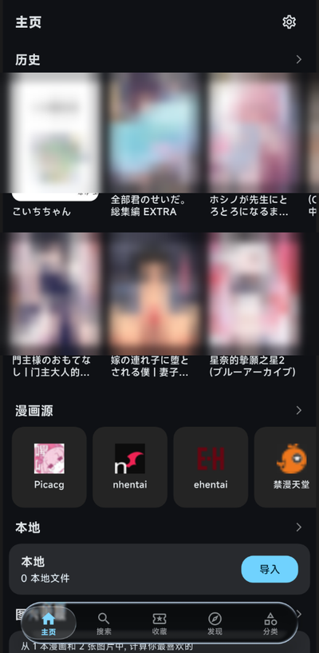
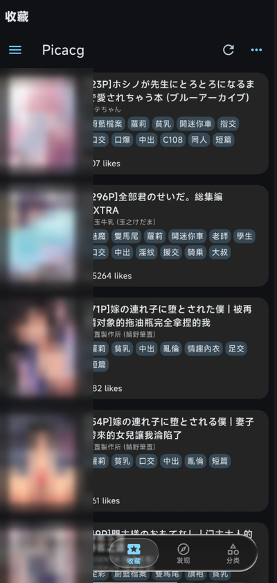
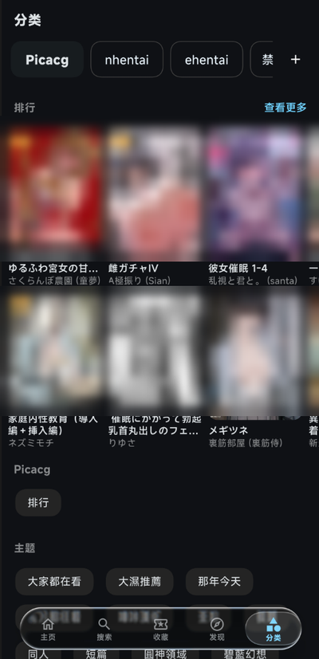
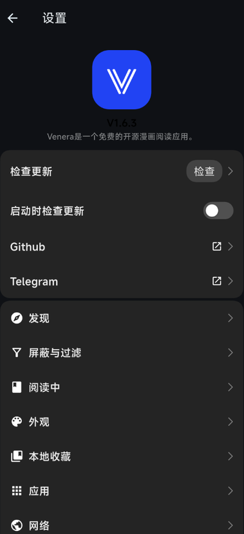

<div align="center">


# venera-miuix

**一款支持本地与网络漫画阅读的漫画阅读器 —— 采用 Miuix 风格重构的 Venera 分支。**

</div>

---

## ⚠️ 版权与许可声明（请先读这一段）

> **本项目基于 [venera-app/venera](https://github.com/venera-app/venera)（原作者 [@wgh136](https://github.com/wgh136) 及全部贡献者）进行重构与优化，遵循 GPL-3.0 协议。**
>
> - 原项目 **Venera** 的著作权归原作者及全部贡献者所有。
> - 本仓库 **原样保留** 了原项目的 [`LICENSE`](LICENSE) 文件（GNU General Public License v3.0）与全部版权声明，未作任何删改。
> - GPL-3.0 是 **强著佐权（copyleft）** 许可证：任何基于本项目发布的衍生作品，**必须公开其全部源代码**，并以同样的 GPL-3.0 协议分发。
> - **严禁** 将本软件或其任何衍生版本 **闭源** 分发、闭源二次开发或用于闭源商业售卖。
> - 若你再次分发本软件，请一并保留 `LICENSE` 文件与本段声明。
>
> 本分支为**非官方**社区分支，与原项目维护者无隶属关系；请勿就本分支的改动去向原项目提交 issue。

---

## 这是什么

原生 **Venera** 是一个优秀的第三方漫画阅读器：用 JavaScript 编写漫画源插件、聚合阅读本地与网络漫画，支持收藏、下载、评论、标签等能力。原作者已公开表示因精力有限停止维护，欢迎 fork。

**venera-miuix** 就是在这个基础上做的一个分支，目标有三件事：

1. **换一套界面语言** —— 以小米 HyperOS 的 **Miuix** 设计体系重做主要页面，并加入悬浮液态玻璃底栏；
2. **补上内容过滤能力** —— 新增完整的「屏蔽与过滤」体系（NSFW 封面遮蔽、标签 / 画师 / 作品屏蔽、屏幕防窥）；
3. **把热路径上的浪费抠掉** —— 封面按显示尺寸解码、去掉滚动时逐帧的离屏模糊等。

与原版 **包名不同**，因此两者可以共存；代价是 **无法覆盖安装原版**，已有数据不会自动迁移。

---

## 界面截图

<p align="center">
  
  
  
  
</p>

<p align="center"><sub>主页 · 收藏 · 分类 · 设置 —— 截图中的作品封面已按「H 是不行的」做过遮蔽处理</sub></p>

---

## 与原版 Venera 的对比

| 能力 | 原版 Venera | venera-miuix |
| --- | :---: | :---: |
| 界面风格 | Material 3（Classic） | **Miuix**（HyperOS 风）为主，Classic 可切换 |
| 底部导航栏 | 标准 NavigationBar | **悬浮液态玻璃底栏**（`liquid_glass_easy`）/ **MD3 悬浮底栏** 可切换，支持 Android 预测返回手势随动 |
| 阅读转场 | — | ✅ 预览卡片 ⇄ 阅读器 **光学径向共享元素转场**（逐像素透镜形变 / 边缘散焦 / 色散 / 玻璃高光），标签跨源归一 |
| 阅读统计 | ❌ 无 | ✅ 主页摘要卡 + 统计页（近 7 天柱状图、题材偏好环形图、灵魂标签 / 标签云、追漫时间轴） |
| 发现页 / 分类页标签栏 | 单行标签，原文未翻译，易被截断 | **源名 + 分区名 双列胶囊**，宽度按最长标签自适应，标签本地化 |
| NSFW 内容遮蔽 | ❌ 无 | ✅ 「H 是不行的」封面遮蔽（安全 / 混合 / 成人向 三态判定） |
| 屏蔽列表 | 仅关键词屏蔽 | ✅ 新增 **标签 / 画师 / 收录作品** 三条可管理列表 |
| 源分级纠正 | — | ✅ 内置 33 源分级预设表，可**逐源查看与纠正**，长按封面可标注 / 解锁单条 |
| 屏幕防窥 | ❌ 无 | ✅ Android `FLAG_SECURE`（禁止截屏 + 最近任务隐藏） |
| 调试入口 | 设置内独立 `Debug` 分类页 | 已移除（日志入口并入 **APP → 排障**） |

### 新增功能详解

- **屏蔽与过滤**（设置 → 屏蔽与过滤）
  - **H 是不行的**：聚合器在**列表层**给作品打内容分级，命中时只糊封面、**不遮标题与标签**，点一下即可显示该条；判定按「用户解锁 → 用户强制 → 用户源级覆盖 → 插件声明 → 内置预设表 → 关键词兜底」的顺序推进。
  - **源分级**：33 个内置漫画源的分级预设表（`assets/source_content_warning.json`）。预设必然存在误判，因此提供逐源纠正入口，改完立即生效，可随时恢复跟随预设。
  - **标签 / 画师 / 收录作品屏蔽**：三条独立列表，各自带总开关。标签按**精确匹配**处置（不会误伤标题），命中后从列表剔除。
  - **屏幕防窥**：开启后系统级禁止截屏与录屏，最近任务中的应用缩略图为空白（部分 ROM 需重启应用生效）。
- **界面**
  - 发现页 / 分类页标签栏重做为「源名 + 分区名」双列胶囊，宽度随系统字号与最长标签自适应，不再出现 `Pic…` 这类截断。
  - 主页、搜索、发现、历史、分类页橱窗等**所有封面入口**统一接入遮蔽与屏蔽体系（含自绘卡片）。
- **性能**
  - 封面按**显示尺寸解码**（缩略图直接由解码器输出），大幅降低列表内存占用与解码耗时。
  - 移除卡片角标上的 `BackdropFilter`（滚动时每帧离屏合成），改为等价观感的实底。
  - 全屏环境背景模糊加缓存层（`RepaintBoundary`），不再逐帧重算。
  - 启动流程并行化：网络、引擎、翻译、内容分级表并行初始化。

---

## v1.6.5 更新内容

- **光学径向转场（预览卡片 ⇄ 阅读器）**
  - 自定义 fragment shader：飞行中逐像素透镜形变（中心清晰、边缘外移）、中段散焦、色散、变暗与玻璃边缘高光，转场首末帧与静止态零差异；
  - 曲线编排：打开快出手长滑行、拖拽 1:1 跟手、松手按剩余距离收尾；飞行圆角随缩放收放，落点与卡片 UI 严丝合缝；
  - 跨源标签归一化：`萝莉 / 蘿莉 / lolicon` 等同一题材的不同写法（繁简 / 中英）聚合到同一偏好条目。
- **阅读统计**
  - 主页摘要卡：今日 / 本周页数与连续阅读天数；
  - 统计页：近 7 天柱状图、本月概览、题材偏好环形图、灵魂标签 + 标签云（一键分享 / 点击跳聚合搜索）、追漫轨迹时间轴（近 30 天 / 近 1 年可切换）。
- **详情页重构**
  - 全面卡片化（浅灰底 + 白卡层次），移除全屏封面模糊——进/出转场掉帧的头号原因；
  - miuix appbar 滚动后 blur → shadow；封面 / 推荐卡 / 评论头像按显示尺寸解码。
- **设置页卡片化**
  - 除外观页外全部子页按分组卡片重排，分类列表加彩色图标徽章，清除 Material 残留控件。
- **底栏**
  - 新增 **MD3 风格悬浮底栏**（无玻璃、无模糊：surfaceContainer 实底 + 阴影 + secondaryContainer pill 指示器），与液态玻璃 / 经典样式三选一。
- **修复**
  - 打开 / 返回阅读器时快速闪黑白的两个根因（被覆盖页被框架二级转场淡出、阅读器加载态与图集底色不一致）；
  - 返回松手后转场动画重播、卡片小框跟随放大等问题。

---

## 原版功能（继承自 Venera）

- 阅读本地漫画（ZIP / 7Z / 文件夹等）
- 使用 JavaScript 编写自己的漫画源
- 阅读网络漫画源的作品
- 管理收藏夹、下载漫画
- 查看评论、标签等作品信息（源支持时）
- 登录后评论、评分等操作（源支持时）
- Headless 模式，见 [Headless Doc](doc/headless_doc.md)

---

## 下载安装包

编译好的安装包发布在本仓库的 **Releases** 页面：

- `venera-miuix-<version>-arm64-v8a.apk` —— 绝大多数现代手机选这个；
- `venera-miuix-<version>-armeabi-v7a.apk` —— 老旧 32 位设备；
- `venera-miuix-<version>-x86_64.apk` —— 模拟器；
- `venera-miuix-<version>.apk` —— 通用包（体积最大，不确定机型时用它）。

> 由于**包名与原版 Venera 不同**，本应用与原版可以共存，但**无法覆盖安装原版**；
> 反之亦然。从原版迁移需要重新登录与配置。

---

## 从源码构建

### 环境依赖

1. 克隆源码到本地
2. 安装 Flutter，见 [flutter.dev](https://flutter.dev/docs/get-started/install)
3. 安装 Rust，见 [rustup.rs](https://rustup.rs/)

### 签名（可选）

`android/key.properties` 不在版本库中（含密钥，已被 `.gitignore` 排除）。
**不提供它也能构建** —— release 会回退使用 Android 的 debug 签名，产物可安装但
不能用于正式分发。若要自行签名发布，在 `android/` 下新建 `key.properties`：

```properties
storeFile=/绝对路径/your-keystore.jks
storePassword=你的库口令
keyAlias=你的别名
keyPassword=你的别名口令
```

### 构建

```bash
flutter build apk --release
```

Android 产物位于 `build/app/outputs/apk/release/venera-miuix-<version>-<abi>.apk`。

---

## 编写漫画源

见 [Comic Source](doc/comic_source.md)。源插件模板与插件 API 来自 [venera-configs](https://github.com/venera-app/venera-configs)。

---

## 致谢

- **Venera**（原作者 [@wgh136](https://github.com/wgh136)）—— 本项目的上游与原作。没有原作者与全部贡献者的工作，就不会有这个分支。**全部原始版权归其所有。**
- **venera-configs** —— 漫画源插件仓库与插件 API。
- **Miuix** —— 界面设计语言与 Flutter 组件库。
- **liquid_glass_easy** —— 悬浮液态玻璃底栏的材质与动效实现。
- **EhTagTranslation** —— 漫画标签的中文翻译数据来源。
- 繁体中文标签翻译由 [@NeKoOuO](https://github.com/NeKoOuO) 提供。

---

## 许可证

[GNU General Public License v3.0](LICENSE)（GPL-3.0）

```
venera-miuix
Copyright (C) 2026 venera-miuix contributors

Based on Venera, Copyright (C) venera-app/venera contributors.
Licensed under the GNU General Public License v3.0.
```

本程序是自由软件：你可以依据自由软件基金会发布的 GNU 通用公共许可证（第 3 版或你选择的任何更新版本）条款重新发布和/或修改它。本程序分发时希望它有用，但不提供任何担保。详见 [`LICENSE`](LICENSE)。
