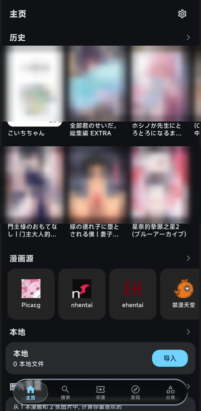
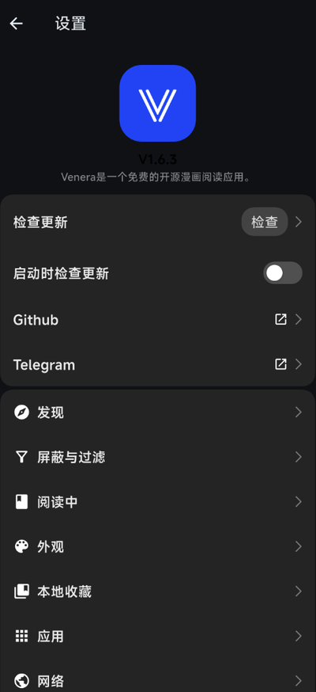

<div align="center">


# venera-miuix

**一款支持本地与网络漫画阅读的漫画阅读器 —— 纯原生 Jetpack Compose 重写的 Venera 分支。**

</div>

---

## ⚠️ 版权与许可声明（请先读这一段）

> **本项目基于 [venera-app/venera](https://github.com/venera-app/venera)（原作者 [@wgh136](https://github.com/wgh136) 及全部贡献者）进行重构与重写，遵循 GPL-3.0 协议。**
>
> - 原项目 **Venera** 的著作权归原作者及全部贡献者所有。
> - 本仓库 **原样保留** 了原项目的 [`LICENSE`](LICENSE) 文件（GNU General Public License v3.0）与全部版权声明，未作任何删改。
> - GPL-3.0 是 **强著佐权（copyleft）** 许可证：任何基于本项目发布的衍生作品，**必须公开其全部源代码**，并以同样的 GPL-3.0 协议分发。
> - **严禁** 将本软件或其任何衍生版本 **闭源** 分发、闭源二次开发或用于闭源商业售卖。
> - 若你再次分发本软件，请一并保留 `LICENSE` 文件与本段声明。
>
> 本仓库为**非官方**社区分支，与原项目维护者无隶属关系；请勿就本分支的改动向原项目提交 issue。

---

## 这是什么

原生 **Venera** 是一个优秀的第三方漫画阅读器：用 JavaScript 编写漫画源插件、聚合阅读本地与网络漫画，支持收藏、下载、评论、标签等能力。

**本分支（`compose-migration`）做的事情，是把整个应用从 Flutter 技术栈完整重写为纯原生 Android 应用：**

1. **Kotlin + Jetpack Compose 全量实现** —— 不再携带 Flutter / Dart 运行时，约 7 万行 Kotlin、89 个单元测试文件；
2. **界面语言延续 Miuix（HyperOS 风）** —— 基于 Miuix KMP 组件库实现，并保留 Material 3 作为可切换的第二风格；
3. **漫画源层完全兼容官方协议** —— 复刻原版 ComicSource JavaScript 协议，官方 [venera-configs](https://github.com/venera-app/venera-configs) 源仓库可以一键安装；
4. **在 Flutter 版的基础上继续扩展** —— 新增了独立的画廊图站模块、反向搜图、画师关注等能力（见下文对比表）。

- 上游原版 Venera（Flutter）：<https://github.com/venera-app/venera>
- 本仓库 `master` 分支（Flutter 版 venera-miuix）：<https://github.com/w13630039663-bit/venera-miuix>

> **安装身份**：本分支与 `master` 的包名完全一致（`com.github.w13630039663bit.venera.miuix`），共用同一条发布线。Flutter 版的数据**不会自动迁移**；可以在设置中使用「导入外部归档」，读取官方 Venera / PicaComic 的备份包来迁移**收藏与阅读历史**。

---

## 界面截图

<!-- 截图待补充：把图片放进 screenshots/ 目录后，放开下面这段即可
<p align="center">
  
  
  
  
</p>
-->

---

## 与 Flutter 版（master 分支）的对比

| 能力 | master（Flutter 版） | compose-migration（本分支） |
| --- | :---: | :---: |
| 技术栈 | Flutter / Dart | **纯原生 Kotlin + Jetpack Compose** |
| 界面风格 | Miuix（Flutter 移植） | **Miuix KMP** + Material 3 双风格可切换 |
| 漫画源协议 | ComicSource JS | 同一套协议，系统 **WebView 承载** + shim 层复刻 |
| 阅读统计 / 标签统计 | ✅ | ✅ |
| 屏蔽与过滤 / 屏幕防窥 | ✅ | ✅ |
| WebDAV 备份同步 | ✅ | ✅ |
| **画廊图站**（yande.re / Gelbooru / Safebooru） | — | ✅ 独立模块，与漫画侧完全隔离 |
| **反向搜图**（SauceNAO） | — | ✅ 搜索卡原地形变接入 |
| **画师关注与画师主页** | — | ✅ 跨站别名归一、头像探测 |
| **每日热门 / 猜你喜欢** | — | ✅ 两站混合打乱、按收藏推荐 |
| **阅读器对开双页** | — | ✅ 5 种排版之一 |

---

## 功能总览

### 阅读器

- **5 种阅读排版**：条漫纵向连续、横向连续画卷、美漫从左至右翻页、日漫从右至左翻页、对开双页拼合；
- **前瞻预加载流水线**（0–20 页可调），翻页不用等网络；
- **自动巡航**：条漫匀速滚动、翻页模式定时自动翻页，触摸即暂停；
- 音量键翻页、点击边缘翻页（方向可反转）、屏幕常亮、夜间柔光滤镜；
- 章节目录抽屉、**章节评论**、单页保存相册与分享；
- Telephoto 手势缩放，**超过 8000px 的超大图自动分块与子采样**，长条漫不爆内存。

### 漫画源引擎

- **兼容官方 ComicSource JavaScript 协议**：由系统 WebView 承载脚本执行，`venera-shim.js` + `venera-init.js` 复刻原版 API 面（HTTP / HTML 解析 / 转换器 / 登录等）；
- 随包内置 **34 个官方源脚本**（33 个唯一源，离线兜底），支持从 venera-configs 仓库**一键安装 / 更新全部官方源**、单独更新、本地导入、可视化编辑与删除；
- 内置 **MangaDex / 拷贝漫画 / 包子漫画** 三个原生 Kotlin 源；
- **登录体系**：账号密码、内嵌 WebView 网页登录、Cookie 直填三种方式，支持重新登录与注销；
- **聚合搜索**：单源搜索 + 「全网聚合」跨源并行搜索；结构化标签搜索在非原生标签语法的源上自动降级为客户端过滤；
- 源测速与健康度展示（首页状态行，点击重测）。

### 画廊（独立模块，与漫画侧隔离）

- **三站聚合**：yande.re（官方日榜）+ Gelbooru（高分池）+ Safebooru，混合打乱成一屏瀑布流；
- **每日热门**二级页（「查看全部」+ 换一批）、**猜你喜欢**主墙（按你的收藏挑标签推荐，带种子随机）；
- **画师关注**：关注名单、圆形头像行、画师主页与跨站作品聚合、画师别名归一；
- **反向搜图**：SauceNAO 以图搜图，接进搜索卡做成原地形变，命中直接跳结果；
- 查看器工具栏：收藏、原图档切换、保存相册、信息面板、分享、**连播**（1–15 秒可调）；
- **视频条目**直接播放（mp4，ExoPlayer），卡片带视频角标与时长；
- 标签翻译（EhTagTranslation 词典）、排行榜窗口、离线 Feed 缓存与刷新策略、滚动越界预取。

### 收藏 / 历史 / 追更

- **本地收藏**：多收藏夹管理、多选批量操作、跨页共享元素转场；
- **网络收藏**：所有源手风琴原地展开，下拉刷新；
- **图片收藏**：阅读中随手收藏的单页与插图，独立画廊浏览；
- **阅读历史**：按源归档，续读进度精准到页；
- **追更**：WorkManager 周期检查收藏作品的更新，更新列表页一键查看。

### 下载与本地

- 多线程下载（1–16 线程可调）、章节级选择、进度通知、暂停 / 继续 / 清空；
- 章节完整性判据：半成品章节不会伪装成完整离线章；
- **CBZ 导出 / 导入**、下载目录自选（支持外置存储公共目录）、本地书架自动扫描。

### 阅读统计

- 首页摘要卡：今日页数、本周累计、连续阅读天数；
- 统计页：总阅读时长、累计页数、常读漫画 **Top 10**、**近 14 天**阅读趋势柱状图、连续打卡；
- **题材分布与标签统计**（近 30 天 / 近 1 年切换）、**追漫轨迹**（每月 Top 题材），标签可一键下钻到聚合搜索。

### 屏蔽与过滤

- **R18 敏感内容分级遮罩**：不过滤 / 封面打码 / 彻底隐藏三态；内置源分级预设表，判定顺序「用户覆盖 → 插件声明 → 预设表 → 关键词兜底」；
- **屏蔽 AI 生成漫画**：只认明确标记（`ai-generated` 标签、标题中的 `[AI Generated]` 等），避免误伤；
- **四类屏蔽规则**：关键词 / 标签 / 画师 / 作品编号，支持正则匹配；
- **屏幕防窥**：系统级 `FLAG_SECURE`，禁止截图、录屏与最近任务缩略图。

### 备份与同步

- 本地 **`.venera` 归档**一键导出 / 导入：阅读历史、本地收藏、阅读统计、屏蔽规则与设置，跨设备无损还原；
- **WebDAV 自动同步**：云端滚动保留最近 10 份，自动淘汰旧备份；
- **导入外部归档**：直接读取官方 Venera（`.venera` SQLite）与 PicaComic（`.picadata`）的备份包，逐条合并收藏与历史（复刻 Dart 哈希做来源反查）。

### 外观与个性化

- **Miuix / MD3 双界面风格**、浅色 / 深色 / 跟随系统；
- **自定义主题色**：种子色 #RRGGBB + 预设色板，或跟随系统壁纸动态取色；
- **界面材质**：实色 / Miuix 液态悬浮玻璃；**导航栏**：Miuix 悬浮栏 / Liquid Glass 液态玻璃；
- 标签译文显示：跟随系统 / 始终简体 / 始终繁体 / 原文；
- 设置主页自定义头图与名言卡；跨 Activity 系统级**预测式返回**动画；封面 → 详情 → 阅读器**共享元素转场**。

### 网络与性能

- HTTP / SOCKS5 代理、下载并发数调节、失败站点熔断与一键重置；
- **Cloudflare 挑战过盾**（带证据链记录）、限速拦截器、按域 UA 与 Cookie 策略；
- 封面与页面**按显示尺寸解码**（inSampleSize），列表内存与解码耗时大幅降低；
- 应用内**检查更新**（GitHub Releases 通道，启动检查 24 小时节流）、日志查看器；
- **App Links 深链直达**：拷贝漫画、包子漫画、MangaDex、B站漫画、禁漫天堂、E-Hentai、nhentai、Wnacg 等站点的作品链接直接跳进应用。

---

## 继承自 Venera 的功能

- 阅读本地漫画（ZIP / CBZ 归档导入与目录扫描）；
- 使用 JavaScript 编写 / 安装自己的漫画源；
- 阅读网络漫画源的作品；
- 管理本地收藏夹与网络收藏、下载漫画离线阅读；
- 查看评论、标签等作品信息，登录后评论、评分（源支持时）。

---

## 下载安装包

编译好的安装包发布在本仓库的 **[Releases](https://github.com/w13630039663-bit/venera-miuix/releases)** 页面；应用内「设置 → 应用 → 检查更新」也指向这条通道。构建产物按 ABI 分包：

- `arm64-v8a` —— 绝大多数现代手机选这个；
- `armeabi-v7a` —— 老旧 32 位设备；
- `x86_64` —— 模拟器；
- 通用包（体积最大，不确定机型时用它）。

> 系统要求：**Android 13（API 33）及以上**。

---

## 从源码构建

### 环境依赖

1. JDK 17；
2. Android SDK（`local.properties` 中配置 `sdk.dir`，Android Studio 打开会自动生成）。

### 构建

```powershell
# 调试包 → app\build\outputs\apk\debug\app-debug.apk
.\gradlew.bat :app:assembleDebug

# 发布包：R8 混淆 + 资源收缩，按 ABI 分包（armeabi-v7a / arm64-v8a / x86_64 / 通用）
.\gradlew.bat :app:assembleRelease

# 单元测试（89 个测试文件，纯 JVM 判据层）
.\gradlew.bat :app:testDebugUnitTest
```

> **签名**：`release` 未配置正式证书时回退 debug 签名，产物可直接侧载验证，但**不要用于正式分发**。要自行签名发布，请在 `app/build.gradle.kts` 的 `signingConfigs` 中替换为你的 keystore。

---

## 项目结构

```text
venera-compose/
├── app/                                # Android 应用模块（唯一 Gradle 模块）
│   └── src/main/java/com/venera/compose/
│       ├── MainActivity.kt             # 入口、主 Tab 宿主与窗口级策略（防窥 / 返回）
│       ├── feature/                    # 业务页面（首页 / 搜索 / 收藏 / 详情 / 设置 / 探索…）
│       ├── reader/                     # 阅读器（5 种排版、预加载、章节评论、缩放）
│       ├── gallery/                    # 画廊模块（data / domain / ui 三层，与漫画侧隔离）
│       ├── source/                     # ComicSource 抽象 + 原生源 + JS 源协议实现
│       ├── engine/                     # WebView JS 引擎与 shim（venera-shim / venera-init）
│       ├── data/                       # db（手写 SQLite）/ prefs / network（OkHttp 栈）
│       ├── download/                   # 下载管理、CBZ 导入导出、本地书架
│       ├── sync/                       # 备份归档、WebDAV 同步、外部归档导入
│       ├── security/guard/             # 内容守卫与屏蔽规则
│       ├── stats/                      # 阅读统计
│       ├── components/ 与 ui/tokens/   # 共用组件与设计 Token
│   └── src/main/assets/
│       ├── sources/                    # 34 个内置源脚本 + index.json
│       └── tags.json 等                # EhTagTranslation 词典 / 繁简转换表 / 分级预设
├── gradle/libs.versions.toml           # 依赖版本单一来源
├── memory/                             # 项目知识库（决策记录与踩坑）
└── docs/ 与根目录 *-2026-*.md          # 方案、评审与审计过程文档
```

---

## 编写漫画源

源插件协议与官方 Venera 完全一致，见 [Comic Source](https://github.com/w13630039663-bit/venera-miuix/blob/master/doc/comic_source.md)。源插件模板与插件 API 来自 [venera-configs](https://github.com/venera-app/venera-configs)；本分支内置的 34 个源脚本即出自该仓库，也可在「源管理」页本地导入自己编写的脚本调试。

---

## 致谢

- **Venera**（原作者 [@wgh136](https://github.com/wgh136)）—— 本项目的上游与原作。没有原作者与全部贡献者的工作，就不会有这个分支。**全部原始版权归其所有。**
- **venera-configs** —— 漫画源插件仓库与插件 API。
- **Miuix** —— 界面设计语言与 KMP 组件库。
- **Kyant0/AndroidLiquidGlass** —— 液态玻璃材质与动效实现。
- **EhTagTranslation** —— 漫画标签的中文翻译数据来源。
- **Material Motion (fornewid) / Telephoto / Coil** —— 转场规格、缩放手势与图片加载。
- 繁体中文标签翻译由 [@NeKoOuO](https://github.com/NeKoOuO) 提供。

---

## 许可证

[GNU General Public License v3.0](LICENSE)（GPL-3.0）

```
venera-miuix
Copyright (C) 2026 venera-miuix contributors

Based on Venera, Copyright (C) venera-app/venera contributors.
Licensed under the GNU General Public License v3.0.
```

本程序是自由软件：你可以依据自由软件基金会发布的 GNU 通用公共许可证（第 3 版或你选择的任何更新版本）条款重新发布和/或修改它。本程序分发时希望它有用，但不提供任何担保。详见 [`LICENSE`](LICENSE)。
