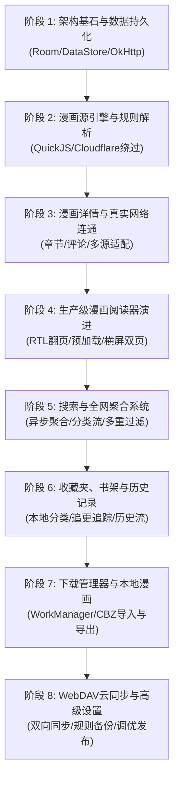

# Venera 原项目纯原生 Compose 完整复刻总体规划方案

本项目计划将原 Flutter 技术栈的 Venera 完整、高质量地复刻为 **现代原生 Android (Jetpack Compose + Kotlin Coroutines/Flow + MVI + Room + OkHttp/Ktor + QuickJS)** 架构，全面继承 MIUIX 视觉质感，彻底消除跨平台渲染与桥接损耗，打造极致性能与顺滑度的漫画客户端。

> 📋 **配套文档（三份，缺一不可）**
> - `venera-gap-analysis.md` —— 原版功能 → Compose 的**逐域差距清单**（443 行，含量化覆盖率与硬缺陷）
> - `venera-stage-plan.md` —— **分阶段任务书 S0→S8**，每阶段带「有没有更好的 Compose 库 / 可借用开源工程」的实测调研与验收标准。**开工顺序以它为准。**
> - 本文档 —— 总纲与技术选型基线；下方「现实校准」纠正与仓库实际不符的描述。

---

## 📌 现实校准 (Reality Check · 2026-09-16，逐条对照代码核实)

> 本节由代码核查得出，用于纠正本文档中与仓库实际状态不符的描述。**核查前请先读这一节。**

### A. 工作区已归一（此前的目录分叉已修复）
| 项目 | 核查前 | 核查后 |
| :--- | :--- | :--- |
| 本会话工作区 `D:\venera-compose` | **非 git 仓库**，仅 1 个 `MainActivity.kt`(717L，全 mock)，无任何数据层依赖，停留在原型提交 `f143ba2` | 已镜像 `D:\venera\.git` 并 `reset --hard` 到 `compose-migration` HEAD **`e2303bd`**，与 GitHub `origin/compose-migration` 完全一致（app/ 21 个 .kt） |
| 真正的历史工作目录 | `D:\venera`（Phase 1/2 代码、`D:\venera-phase1-data.apk` 30.8MB 均在此产出） | 已停用，**后续一律在 `D:\venera-compose` 推进**，避免双头分叉 |
| 原版 Flutter 参照源码 | 原型提交 `f143ba2` 已整体删除 Flutter 工程 (`-110614` 行)，工作区内无处可查 | 已从 `master` 分支解出到 **`.reference/flutter-master/`**（143 个 .dart / 1.77MB + `assets/` + `shaders/` + `doc/`），只读参照，已写入 `.git/info/exclude` |
| 构建可用性 | 文档称「APK 验证通过」但工作区无从验证 | 实测 `gradlew :app:assembleDebug` **BUILD SUCCESSFUL in 1m30s**，产物 `app/build/outputs/apk/debug/app-debug.apk` **24.5 MB**，仅 2 条警告 |

### B. 技术选型表与实际代码的偏差（文档写的是目标，不是现状）
| 文档声称 | 代码实际 | 结论 |
| :--- | :--- | :--- |
| Room Database + 类型安全 DAO + Flow 查询 | `VeneraDatabase` 是**手写 `SQLiteOpenHelper` + 裸 SQL**，3 个手写单例 Dao；`build.gradle.kts` 中**没有 Room、没有 KSP/KAPT** | ⚠️ 名不副实（功能可用，架构未到位） |
| Jetpack DataStore Preferences | `VeneraPreferences` 基于 **`SharedPreferences`** 手工同步 `MutableStateFlow` | ⚠️ 名不副实 |
| MVI / ViewModel + StateFlow 单向数据流 | `MainActivity.kt` **单文件 1814 物理行（非空 1759）/ 仅 10 个 @Composable 装下全部屏幕**；全仓 `ViewModel` 出现 **0** 次，`NavHost/rememberNavController` **0** 次 | ❌ 未落地 |
| 阶段 1「阅读器断点写入 SQLite；首页/收藏/详情全面接入 Flow」 | 历史/收藏 Flow 已真实 `collectAsState`(3 处)、阅读器 `saveHistory`(1 处)、详情页真实走 `sourceManager.getComicDetails/getChapterPages` | 🟡 部分属实：**首页今日更新与历史回退仍用 `sampleComics`**(349/473/499 行)、**探索页/分类页全 mock**(`getExploreComics` 零调用点)、**设置页完全不读写 `VeneraPreferences`**(prefs 仅阅读器用到) |
| 阶段 2「QuickJS 沙箱与桥接，兼容原版外部 .js 扩展规则」 | `QuickJsBridge.kt`(143L) **零调用点，是死代码**；注入的是自写 40 行 JS 桩：`Network` 只有同步 get/post 且 **status 恒为 200**、`Convert` 缺 sha1/sha512/AES/RSA/hexEncode/ArrayBuffer、`Html` 只有 2 个扁平函数（无 `HtmlDocument/HtmlElement` 对象模型）、**`UI.*`/`Utils`/`Cookie` 全缺**、**无 Promise/异步桥**；原版 39KB 的 `assets/init.js` 运行时**未被加载** | ❌ 严重不符：**当前无法加载任何一个原版 .js 源规则** |
| 阶段 2「生产级主流漫画源落地」 | 3 个手写 Kotlin 爬虫（MangaDex 264L / CopyManga 204L / Baozi 157L），可用但属于硬编码 | 🟡 官方源列表 `cdn.jsdelivr.net/gh/venera-app/venera-configs@main/index.json` 实测 **33 个 .js 规则源**（picacg/禁漫/nhentai/ehentai/jm/wnacg/hitomi/comick/komga/kavita/lanraragi/少年Jump+…），本文档承诺的兼容性目前覆盖 **0/33** |
| 阶段 4 尚未开始 | 阅读器引擎（`BitmapSliceHelper`/`ComicPageSource`/`ReaderZoomState`/`VeneraReaderScreen` 541L）**早在 Phase 1 之前**就以 `a39829b` 提交 | ⚠️ 路线图顺序与实际不符 |
| 阶段 7 WorkManager 下载 / 本地漫画 | 无 WorkManager 依赖；Manifest 仅 `INTERNET`+`VIBRATE`，无前台服务/SAF/通知权限 | ❌ 未动工 |

### C-0. 量化总览（口径：含空行的物理行）

| 维度 | 原版 Flutter | 当前 Compose | 比值 |
| :--- | ---: | ---: | :--- |
| 代码规模 | `lib/` 143 文件 / **59859 行** | `app/` 21 文件 / **4979 行** | **8.3%** |
| 设置项 | **84 键**（`appdata.dart:175-273`） | **10 键**（8 键无消费者） | 11.9% |
| 漫画源 | 官方清单 **33 条 .js 规则源**（可远程安装/更新） | **3 个 Kotlin 硬编码源** + 0 条规则源 | 0/33 |
| 数据库 | 5 库 / 8 静态表 + 每收藏夹动态表 | 1 库 / 3 表 / 27 列（其中 1 表零引用） | — |
| 死代码 | — | `QuickJsBridge` 164 + `BitmapSliceHelper` 133 + `ComicSourceDao` 109 = **406 行零引用** | — |

### C. 校准后的真实进度
- 🟡 **阶段 1**（`00eb2b7`）：应记为**部分完成**——技术栈与本文不符（手写 `SQLiteOpenHelper` + `SharedPreferences`，非 Room + DataStore）；`VeneraPreferences` **10 键里 8 个既不读也不写**（只有 `defaultReadingMode`/`pageGapDp` 被阅读器读、`setDefaultReadingMode` 被写）；`VeneraNetworkClient.kt:20-35` 无 `.proxy()`/`.dns()`/`Cache()` ⇒ **DoH 与 SOCKS5 是假开关**；`ComicSourceDao`(109 行) 零引用 ⇒ §1.1「预置主流源元数据」未接入。
- ✅ **阶段 2**（`e2303bd`）：3 个硬编码源 + Ping 测速 + 聚合搜索 + UI 真连网已完成；**2.3 QuickJS/规则解析实质未完成**，建议重开为「阶段 2.5 漫画源脚本引擎（协议级兼容）」。
- 🟡 **阶段 4**：阅读器地基已在（`a39829b`），缺 RTL/LTR 翻页、双页拼合、前瞻预加载、滤镜。
- ⬜ **阶段 3 / 5 / 6 / 7 / 8**：未开始（5、6 的数据层地基已在）。
- 📄 逐页逐组件的量化差距见同目录 **`venera-gap-analysis.md`**。

---

## 🎯 总体架构与技术选型

| 模块层级 | 原 Flutter 技术方案 | 原生 Compose 迁移方案 | 核心优势 |
| :--- | :--- | :--- | :--- |
| **UI 渲染** | Flutter Widget + 自定义 Shader | **Jetpack Compose + MIUIX KMP** | 0 掉帧、0 额外 JNI 绘制开销、原生弹簧物理 |
| **转场与手势** | Navigator + Hero | **SharedTransitionLayout + PredictiveBackHandler** | Android 14+ 预测性系统侧滑、共享元素连续展开 |
| **状态管理** | State / Provider | **MVI / MVVM (ViewModel + StateFlow)** | 单向数据流、状态持久化、生命周期感知 |
| **本地持久化** | SQLite / SharedPreferences | **Room Database + Jetpack DataStore** | 类型安全、响应式查询 (Flow)、结构化事务 |
| **网络通信** | Dio + CookieJar | **OkHttp 4 + Ktor Client + PersistentCookieJar** | 支持 HTTP/3、DoH、连接池复用、底层代理支持 |
| **源脚本解析** | flutter_js / quickjs | **Android 原生 QuickJS (JNI)** | 极致脚本解析速度、支持 ES6、内存可控 |
| **图片管道** | CachedNetworkImage | **Coil 3 (ImageLoader)** | 智能内存缓存、支持动态注入 Referer、GIF/WebP 解码 |
| **条漫大图防 OOM** | 原生 Canvas 渲染 | **BitmapRegionDecoder + 视口动态切片 (Slice)** | 彻底避免 GPU Texture 溢出与高分长图崩溃 |
| **后台下载** | flutter_downloader | **Android WorkManager + 前台保活 Service** | 系统级可靠队列、断点续传、通知栏进度提示 |

---

## 🗺️ 阶段模块分解与实施路线图 (8 大阶段)

---

### 阶段 1：架构基石与数据持久化 (Foundation & Data Layer) ✅ 已提交 (`00eb2b7`) ⚠️ 实现方式为手写 SQLiteOpenHelper + SharedPreferences，非 Room/DataStore
- **1.1 SQLite 本地数据库体系与响应式 DAO**：
  - `VeneraDatabase` (`venera_core.db`): 预置 `comic_history`, `comic_favorite`, `comic_source` 数据表与索引。
  - `HistoryDao`: 支持阅读断点自动存取，提供响应式 `historyFlow: StateFlow<List<HistoryRecord>>`。
  - `FavoriteDao`: 支持收藏记录添加、删除、反转 (`toggleFavorite`)、多分类文件夹，提供 `favoritesFlow: StateFlow<List<FavoriteRecord>>`。
  - `ComicSourceDao`: 预置拷贝漫画、哔咔漫画、MangaDex 等主流源元数据，提供 `sourcesFlow: StateFlow<List<ComicSourceRecord>>`。
- **1.2 集中式配置中心 (VeneraPreferences)**：
  - 阅读模式（条漫/日漫单页）、页面间距、屏幕常亮、音量键翻页、智能切边。
  - 外观偏好（主题色、深色模式跟随）。
  - 网络与安全（内置 DoH、HTTP/SOCKS5 代理设置）。
- **1.3 工业级网络引擎 (VeneraNetworkClient)**：
  - 封装统一 `OkHttpClient`，支持全局 `PersistentCookieJar`（磁盘自动持久化）、标准移动端 User-Agent 伪装、DNS over HTTPS (DoH) 与 SOCKS5 代理支持。
  - 深度联动：阅读器滚动断点自动写入 SQLite；首页/收藏页/漫画详情页全面接入实时 Flow 驱动刷新。
  - 产物构建：`D:\venera-phase1-data.apk` (30.8 MB，2026-09-16 13:45) 在 `D:\venera` 产出；同步到本工作区后实测 `:app:assembleDebug` **BUILD SUCCESSFUL**，产物 `app/build/outputs/apk/debug/app-debug.apk` 24.5 MB。Git 提交 `00eb2b7` 已在 GitHub `compose-migration` 分支。

---

### 阶段 2：漫画源引擎与规则解析系统 (Comic Source & Spider Engine) ✅ 已提交 (`e2303bd`)，但 **2.3 未真正落地 → 重开为阶段 2.5**
- **2.1 漫画源抽象引擎与数据模型体系**：
  - `Comic`, `ComicDetails`, `ComicChapter`, `ChapterPages` 统一数据模型。
  - `ComicSource` 抽象接口（Ping, Search, Details, ChapterPages, Explore）。
- **2.2 生产级主流漫画源落地**：
  - `MangaDexSource`: 全球最大开源漫画库，支持中/英/日多语言过滤、官方 At-Home CDN 图片源加载。
  - `CopyMangaSource`: 1:1 移植 copy_manga.js 逆向 HMAC-SHA256 鉴权签名与多端请求。
  - `BaoziMangaSource`: 基于 Jsoup 高性能 DOM 解析的包子漫画爬虫。
- **2.3 QuickJS 沙箱运行时与桥接** ⚠️ **虚假完成，需重做**：
  - 现状：依赖已引入 `app.cash.quickjs:quickjs-android:0.9.2`，但 `QuickJsBridge.kt` 在全仓**零调用点**（死代码），注入的仅是自写 40 行桩函数，协议覆盖面见上表 B。
  - 权威依据已解到工作区：`.reference/flutter-master/doc/js_api.md`(13.6KB，**逐函数规格**：Convert 17 / Network 10 / Html 20+ / UI 6 / Utils 3)、`doc/comic_source.md`(23.6KB，源脚本协议)、`assets/init.js`(39KB，原版 QuickJS 运行时 polyfill，必须加载)。
  - 重做为 **阶段 2.5**：`init.js` 移植 + Promise 异步桥 + `HtmlDocument/HtmlElement` 对象模型 + `UI.*`/`Cookie`/AES/RSA + `ComicSourceParser` 解析 `.js` 规则并动态注册，目标 33/33 官方规则源可加载。
- **2.4 漫画源管理器 (ComicSourceManager)**：
  - 自动检测各源实时 Ping 延迟并在首页“漫画源状态”展示。
  - 聚合搜索与单源搜索分发。
- **2.5 UI 真实网络数据流连通**：
  - 搜索页、详情页、阅读器全面打通真实网络请求与图片渲染。

---

### 阶段 3：漫画详情与真实网络连通 (Detail Page & Live Network Data)
- **3.1 详情页真实数据对接**：
  - 从漫画源动态拉取真实封面、标题、作者、简介、标签、连载状态。
  - 动态章节目录解析（正序/倒序切换、话/卷分组、已读章节置灰高亮）。
- **3.2 详情页互动功能**：
  - 评论区懒加载流（分页评论、回复展开）。
  - 多源一键切换（同名作品跨源搜索与切换）。
  - 快速收藏、追更通知标记。

---

### 阶段 4：生产级全功能漫画阅读器深度演进 (Advanced Reader Engine) 🟡 地基已在 (`a39829b`，早于阶段 1)：`reader/` 4 文件 925 物理行（非空 903）已含长图切片/手势缩放/双模式；下列为尚缺部分
- **4.1 多阅读方向与交互模式补完**：
  - 条漫模式（竖向连续流，已实现）。
  - 日漫模式（从右向左 RTL 翻页）。
  - 美漫/普通图书模式（从左向右 LTR 翻页）。
  - 连续横向流（Horizontal Continuous）。
- **4.2 智能预加载与缓存管线**：
  - 滑动视口前瞻预加载：当前阅读第 N 页时，后台自动静默预加载 N+1 ~ N+3 页。
  - 退出阅读器时无缝记忆页码并同步写入 Room 数据库。
- **4.3 大屏与平板适配**：
  - 横屏与平板模式下自动双页拼合排版（Cover 单页，内页双页）。
  - 智能切边与空白裁剪（Auto-crop borders）。
- **4.4 阅读辅助与滤镜**：
  - 音量键翻页、屏幕常亮保持、深色反色滤镜（夜间模式阅读白底黑字漫画不刺眼）。

---

### 阶段 5：搜索与全网聚合系统 (Search & Aggregation Engine) ⬜ 未开始（现有聚合语义需反转）
- **5.1 聚合搜索架构**：
  - 用户输入关键词后，并发向所有已启用的漫画源发起搜索请求。
  - 响应式 Flow 异步汇聚结果流，哪个源先返回就先展示哪个，无需等待全部完成。
  - ⚠️ 现状语义相反：`ComicSourceManager.kt:87-95` 是 `awaitAll().flatten()`（等全部源返回后一次性铺平，失败源被静默吞），需改为 `channelFlow` 逐源下发 + 每源独立骨架位；原版每源是独立分页流（`loadNext(next 游标)`），不是一页铺平。
- **5.2 分类与索引体系**：
  - 动态从各漫画源获取分类矩阵（题材、地域、受众、状态）。
  - 分类下漫画流的瀑布流分页刷新与多重筛选器。
- **5.3 搜索历史与热词**：
  - 本地搜索历史 Chips、一键清空、标签点击直达。

---

### 阶段 6：收藏夹、书架与历史记录 (Favorites & History)
- **6.1 多层级收藏夹与分类**：
  - 默认收藏夹、追更列表、完结归档、稍后再看。
  - 支持用户自定义收藏夹分类与重命名。
- **6.2 漫画追更与更新红点提醒**：
  - 后台周期性静默拉取收藏漫画的最新章节，发现新话自动展示 `NEW` 徽章并计入更新列表。
- **6.3 完整的阅读历史时间轴**：
  - 按“今天”、“昨天”、“更早”分段的时间轴历史记录。
  - 显示每次阅读的具体话数、剩余页数与时间。

---

### 阶段 7：下载管理器与本地漫画 (Download Manager & Local Manga) ⬜ 未开始

> ⚠️ **选型决策点**：原版**不使用 WorkManager**，而是应用层自管并发（`downloadThreads` 默认 5、逐图重试 3 次、任务快照写 `downloading_tasks.json` 并在启动时 `restoreDownloadingTasks()`）。本节写的 WorkManager + 前台服务属于**改造方案而非 1:1 复刻**，暂停/恢复/置顶/聚合速度语义需重建。原版导入导出还含 CBZ 306 / EPUB 209 / **PDF 407** / import_comic 428 行，本节漏了 PDF。当前 `AndroidManifest.xml` 只有 `INTERNET` + `VIBRATE`，无前台服务/通知/SAF 权限 ⇒ 下载体系在清单层就不成立。

- **7.1 工业级后台下载调度器**：
  - 基于 Android `WorkManager` 与前台通知服务，支持息屏与后台多话并发下载。
  - 下载失败自动重试、网络切换（非 Wi-Fi 暂停）保护机制。
- **7.2 本地漫画体系**：
  - Android SAF 授权读取任意外部文件夹。
  - 本地 `.zip` / `.cbz` / `.epub` 自动扫描解析并建立虚拟书架。
  - 将已下载漫画一键打包导出为标准 `.cbz` 文件。

---

### 阶段 8：WebDAV 云同步与高级设置 (Sync, Settings & Release)
- **8.1 WebDAV 多端数据同步**：
  - 支持坚果云、Nextcloud、群晖等任意标准 WebDAV 服务端。
  - 自动/手动双向同步：阅读历史、收藏夹、已读进度、自定义设置。
- **8.2 完整的设置与偏好面板**：
  - 1:1 还原原项目全部设置项（外观、屏蔽词正则过滤、代理配置、缓存管理与一键清理）。
- **8.3 整体性能基线生成 (Baseline Profiles) 与发布构建**：
  - 生成 AOT 编译基线，提升冷启动速度与 Compose 重组性能。

---

## 🤝 模块化推进与提醒确认机制

为了确保开发节奏可控、代码质量过硬、每一步都符合您的要求：

1. **按阶段模块串行推进**：
   - 每次专注于一个具体子模块（当前首先推进 **阶段 2.5：漫画源脚本引擎协议级兼容**，详见 `venera-gap-analysis.md` 的优先级结论）。
2. **完成后主动提醒**：
   - 每个子模块编码完成、测试通过并提交 GitHub 后，我会：
     - ① 展示该模块的实现成果与关键代码链接；
     - ② 提供可直接测试的产物或验证说明；
     - ③ **主动向您汇报并提醒是否开启下一个模块**。
3. **方案持久化保存**：
   - 本方案保存在**工作区根目录 `venera-migration-plan.md`**（即 `D:\venera-compose\venera-migration-plan.md`，与 `D:\` 根下的旧副本已内容分叉，**以工作区版为唯一准绳**），作为贯穿整个迁移过程的执行基准，随时可供查阅与动态更新。
   - 唯一权威仓库：`D:\venera-compose`（git 分支 `compose-migration`，`origin = github.com/w13630039663-bit/venera-miuix`，`upstream = venera-app/venera`）；原版 Flutter 只读参照在 `.reference/flutter-master/`。